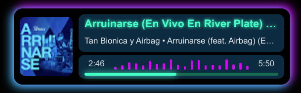

# YouTube Music Overlay 🎶

An Electron-based overlay designed to display real-time information about the currently playing song on YouTube Music. This project is ideal for streamers and developers who want a visually appealing and modern way to showcase their music during live streams.

![YouTube Music Overlay Screenshot]

## Features 🌟

-   **Real-Time Data**: Displays song title, artist, album, and album art directly from YouTube Music.
-   **Customizable Overlay**: Easily adjustable CSS for colors, animations, and layout.
-   **Always-On-Top**: Perfect for live streams, as the overlay stays above other windows.
-   **Cross-Platform**: Built with Electron, compatible with Windows, macOS, and Linux.

## Getting Started 🚀

1. **Clone the Repository**:

    ```bash
    git clone https://github.com/LucasJappert/youtube-music-with-overlay
    cd youtube-music-with-overlay
    ```

2. **Install Dependencies**:

    ```bash
    npm install
    ```

3. **Run the Application**:

    ```bash
    npm run start
    ```

    This will launch the overlay and connect it to YouTube Music, displaying the current song details.

4. **Build the Application**:
    ```bash
    npm run build
    ```

## Contributing 🤝

All developers are welcome to contribute! Whether it's fixing a bug, adding a new feature, or improving the documentation, your input is valuable. Feel free to fork this project, make your changes, and submit a pull request.

1. **Fork the Repository**
2. **Create a New Branch**:
    ```bash
    git checkout -b feature/your-feature-name
    ```
3. **Make Your Changes and Commit**:
    ```bash
    git commit -m "Add your message here"
    ```
4. **Push to Your Branch**:
    ```bash
    git push origin feature/your-feature-name
    ```
5. **Submit a Pull Request**

## License 📜

This project is licensed under the MIT License, so feel free to use, modify, and distribute it as you wish!

## Feedback & Issues 🐞

Found a bug or have an idea for improvement? Please open an issue on this repository.

---

Thanks for checking out YouTube Music Overlay! If you like the project, consider starring ⭐ it on GitHub, and feel free to share any feedback you have!
